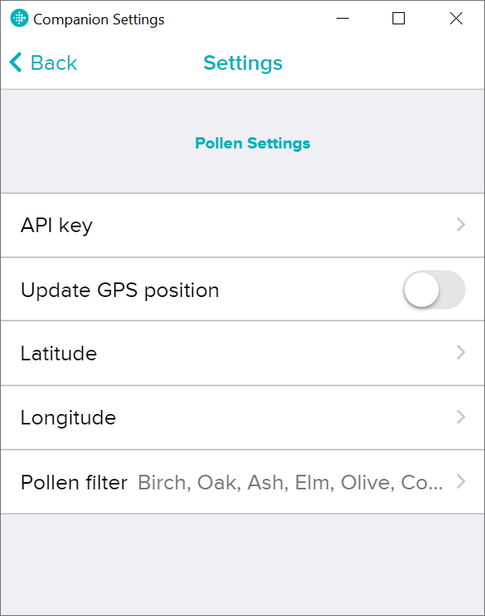

# FitbitPollen
A Fitbit app to track pollen levels. Developed using the official Fitbit SDK.

## Getting Started

The pollen data is access using the Breezometer Pollen API, thus an API key is **necessary**. Latitude and longitude are also mandatory to produce a valid API call. These coordinates are set either automatically (reading latest Fitbit position) or manually (user settings). User settings are set using the Fitbit Companion app and allows the user to add their API key, preferred position and filter desired plant types.

## Built With

* [Fitbit SDK](https://studio.fitbit.com/) - The web framework used
* [Breezometer Pollen API](https://docs.breezometer.com/api-documentation/pollen-api/v2/) - API Documentation
* [Fitbit Reference](https://dev.fitbit.com/build/reference/) - Reference material
* [Fitbit Guides](https://dev.fitbit.com/build/guides/) - SDK examples

## License

This project is licensed under the MIT License - see the [LICENSE.md](LICENSE.md) file for details

## TODO

* Translate settings window
* API key verification
* Latitude and longitude verification (when set manually)
* Specific icons for each plant type
